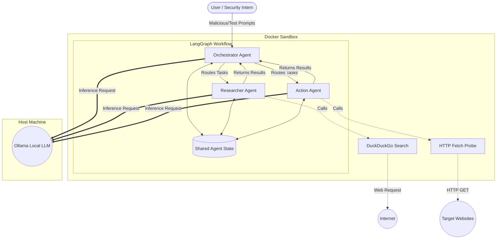

# Multi-Agent Security Testing Framework Architecture

This diagram illustrates the flow of data, tool execution, and inference requests within the system.

### Key Components

1. **Docker Sandbox:** Encapsulates the entire multi-agent application to ensure that any malicious payloads injected during testing cannot escape and harm the host operating system.
2. **LangGraph Workflow:** Forces a "hub-and-spoke" design. All agents must route back to the Orchestrator, preventing infinite AI loops. All communication is recorded in the `Shared Agent State`.
3. **Local LLM (Ollama):** Running securely on the host machine. The Docker container communicates with it via `host.docker.internal`.
4. **Tool Isolation:** The Action Agent's network requests (`HTTP Fetch Probe`) are strictly limited to external websites, ensuring safe live-testing against targets.
